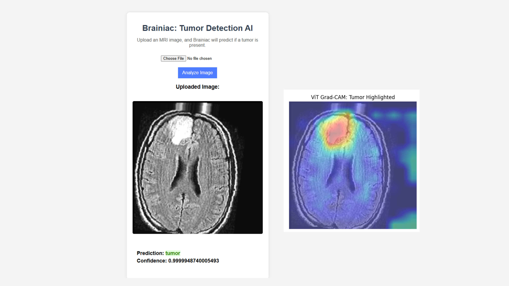

# Brainiac: Your AI tool for MRI scans that has sharper vision to make smarter decisions

**Names: Chloe, Masuma, Maryanne**

Team: MacDonald Bridge



## Table of Contents

- [Tools Used](#tools-used)
- [Setup Instructions](#setup-instructions)
- [Testing](#testing)
- [UI Testing](#ui-testing)
- [File Structure](#file-structure)

## Tools Used

- **Python**: Programming language used for backend development.
- **Flask**: Web framework used for creating the web application.
- **Virtualenv**: Tool used for creating isolated Python environments.
- **Google Drive**: Used for storing and sharing the model file.
- **HTML/CSS**: Used for front-end development.

## Setup Instructions

1. **Create a virtual environment:**

   ```sh
   python -m venv venv
   ```

2. **Activate the virtual environment:**

   - On Windows:
     ```sh
     .\venv\bin\activate
     ```
   - On macOS and Linux:
     ```sh
     source venv/bin/activate
     ```

3. **Install requirements within the virtual environment:**

   ```sh
   pip install -r requirements.txt
   ```

4. **Download model from the following link and place into project folder:**

Note: need to have access permissions via email to download model

[Google Drive link](https://drive.google.com/drive/folders/1RMO9VaVmPAmpuvj3_KWvFcfCKGfVryfz?usp=drive_link)

5. **Set up environment variables for the following:**

   - `CEC_2025_dataset` : the path for the data test folder
   - `MODEL` : path to the model file

6. **For front-end, run the following:**
   ```sh
   flask run
   ```

## Testing

1. **Upload the images into the dataset test folder**

2. **From the command line, run the following**

   ```sh
   python test.py
   ```

3. **Output for the tests will be seen in results.csv file**

## UI Testing

1. From the command line, run the following

   ```sh
   flask run 
   ```

2. Upload a tumor or non tumor image on the file input then press the analyze button

3. View the image, the predicted label and confidence score


## File Structure 

`/train` : this folder contains our model training notebook, this is the training steps we took to extract out best final finetuned model. 

`/static` : contains /highlighted and /uploads and other images. The hightlighted images were passed through grad-cam to get heat map of the tumors.

`/templates` : contain the index.html for our frontend structure.

`app.py` : this is the flask back-end

`test.py` : this is our test file that returns the csv prediction the judges will use.

`requirement.txt` : this contains the dependency used in our UI and test file.

